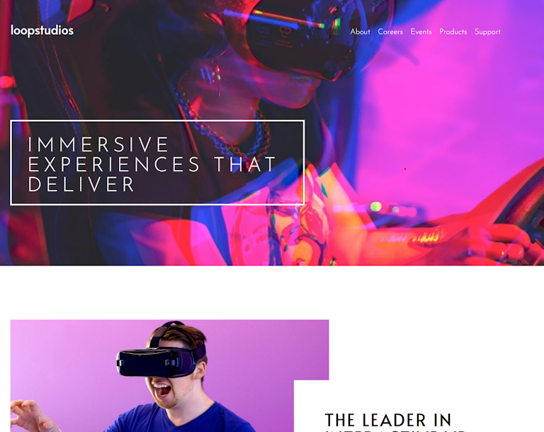
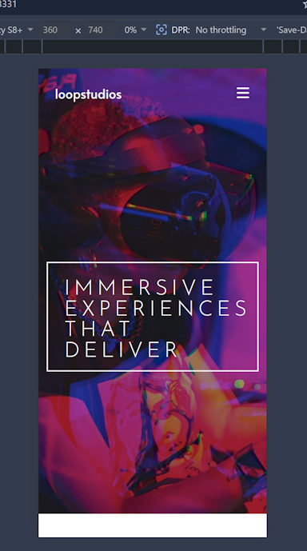
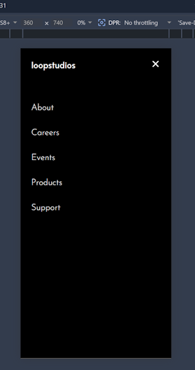

# LoopStudios landing page solution

This is my solution to
the Frontend Mentor's [Loopstudios landing page challenge](https://www.frontendmentor.io/challenges/loopstudios-landing-page-N88J5Onjw).

## Table of contents

- [Overview](#overview)
  - [Screenshots](#screenshots)
  - [Links](#links)
- [My process](#my-process)
  - [Built with](#built-with)
  - [What I learned](#what-i-learned)
  - [Continued development](#continued-development)
  - [AI Collaboration](#ai-collaboration)
- [Author](#author)

## Overview

### Screenshots

#### Desktop view



#### Mobile view



#### Mobile menu



### Links

- Solution URL: <https://github.com/FJSolutions/fm-loopstudios-landing-page>
- Live Site URL: <>

## My process

### Built with

- Semantic HTML5 markup
- CSS custom properties
- Flexbox
- CSS Grid
- Mobile-first workflow
- [LightningCSS](https://lightningcss.dev/)

### What I learned

The project was a great opportunity to use BEM for my CSS styles. It flattened out the hierarchy to three levels at maximum. I was still able to use `lightningcss`'s `use` directive so I could split the source files up for manageability &ndash; which was great. Having used BEM a couple of times now I am fully over my prejudice of the ugly naming convention, for the ease and consistency of naming styles.

There was nothing special about the code I wrote, all the learnings were with the tech-stack and setup; the bottom line: I'm sticking with using `vite` even for the siple stuff as it just provides so much out of the box and adding `1lightningcss` as a plugin is trivial and consistent to other plugins.

### Continued development

Use this section to outline areas that you want to continue focusing on in future projects. These could be concepts
you're still not completely comfortable with or techniques you found useful that you want to refine and perfect.

### AI Collaboration

I got stuck with the images in mobile view, so, after Googling for a while and trying a few things I asked Claude what I
was doing wrong; this helped considerably and got me to a place where I moved from trying to get the `srcset` on `` working and moved to using `<picture>`, which removed my headaches.

- Claude Code

## Challenges

I had a challenge setting up `lightningcss` on the cli. I've previously used it through `vite`, which works
seamlessly, but it had an issue with how `pnpm` creates symlinks. The problem resolved to be:

```shell
pnpm aprove-builds
```

In this post-install script it sets up the Windows paths correctly. The fix for reproducing this correctly is to add the
following to the `package.json` file:

```json
  "pnpm": {
"onlyBuiltDependencies": ["lightningcss-cli"]
}
```

## Author

- Frontend Mentor - [Francis Judge](https://www.frontendmentor.io/profile/FJSolutions)
